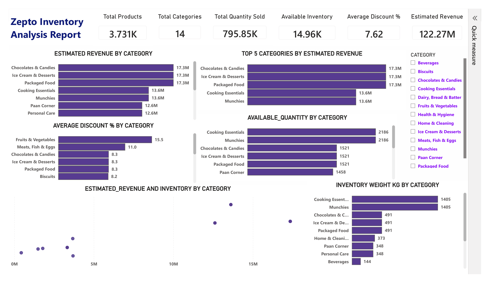
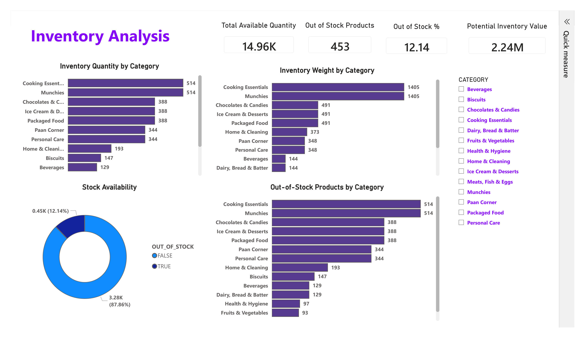

# Zepto Inventory Analysis Using Oracle SQL & Power BI

## Project Overview



**Zepto Inventory Analysis** is a SQL and Power BI data analytics project focused on analyzing product pricing, discounts, estimated revenue, inventory availability, product weight, and out-of-stock performance across different product categories.

The project uses **Oracle SQL** for data storage, cleaning, validation, and business analysis. The cleaned data is then visualized through an interactive **Power BI dashboard**.

The objective of this project is to generate actionable insights that can help Zepto improve inventory planning, pricing strategies, product promotions, and stock replenishment decisions.

---

## Business Objective

Zepto wants to understand the performance of its products and inventory across different categories.

The analysis aims to:

* Identify the top-performing product categories
* Analyze estimated revenue by category
* Find products with the highest discounts
* Identify products with high MRP but low discounts
* Compare MRP with discounted selling price
* Analyze available inventory by category
* Identify out-of-stock products
* Calculate inventory weight by category
* Estimate the potential value of available inventory
* Support better pricing and inventory management decisions

---

## Business Questions

The analysis answers the following key business questions:

1. What are the top 10 products based on discount percentage?
2. Which products have a high MRP but are currently out of stock?
3. What is the estimated revenue or inventory value by category?
4. Which products have an MRP greater than ₹500 and a discount below 10%?
5. Which five categories offer the highest average discount percentage?
6. What is the price per gram for products weighing more than 100 grams?
7. How can products be grouped into low, medium, and high weight categories?
8. What is the total inventory weight by category?
9. What percentage of products are out of stock?
10. Which category has the highest available inventory?
11. Which categories contribute the most to estimated revenue?
12. Which products and categories require closer inventory monitoring?

---

## Dataset Overview

The dataset was imported from a CSV file into an Oracle database table named `ZEPTO_INVENTORY`.

The dataset contains product-level information related to:

* Product categories
* Product names
* MRP
* Discount percentage
* Available quantity
* Discounted selling price
* Product weight
* Stock availability
* Product quantity

The dataset contains approximately **3.7K product and SKU records** across **14 product categories**.

### Product Categories

The dataset contains the following categories:

* Beverages
* Biscuits
* Chocolates & Candies
* Cooking Essentials
* Dairy, Bread & Batter
* Fruits & Vegetables
* Health & Hygiene
* Home & Cleaning
* Ice Cream & Desserts
* Meats, Fish & Eggs
* Munchies
* Paan Corner
* Packaged Food
* Personal Care

---

## Database Table Creation

The following Oracle SQL statement was used to create the inventory table:

```sql
CREATE TABLE zepto_inventory (
    sku_id NUMBER(10) GENERATED AS IDENTITY PRIMARY KEY,
    category VARCHAR2(100) NOT NULL,
    name VARCHAR2(100) NOT NULL,
    mrp NUMBER(10,2),
    discountPercent NUMBER(5,2),
    availableQuantity NUMBER(3),
    discountedSellingPrice NUMBER(10,2),
    weightInGms NUMBER(5),
    outOfStock VARCHAR2(10),
    quantity NUMBER(5)
);
```

### Table Columns

| Column | Data Type | Description |
|---|---|---|
| SKU_ID | NUMBER | Automatically generated unique SKU identifier |
| CATEGORY | VARCHAR2 | Product category |
| NAME | VARCHAR2 | Product name |
| MRP | NUMBER | Maximum Retail Price |
| DISCOUNTPERCENT | NUMBER | Discount percentage offered |
| AVAILABLEQUANTITY | NUMBER | Quantity currently available in inventory |
| DISCOUNTEDSELLINGPRICE | NUMBER | Product selling price after discount |
| WEIGHTINGMS | NUMBER | Product weight in grams |
| OUTOFSTOCK | VARCHAR2 | Indicates whether the product is out of stock |
| QUANTITY | NUMBER | Product quantity associated with the record |

> Oracle stores unquoted column names in uppercase. Therefore, `weightInGms` is referenced as `WEIGHTINGMS` in SQL queries.

---

## Data Import

The CSV file was imported into the `ZEPTO_INVENTORY` table using an Oracle SQL import tool such as SQL Developer.

The `SKU_ID` column is generated automatically using an identity column. Therefore, it does not need to be manually imported from the CSV file.

### Sample Data

```sql
SELECT *
FROM zepto_inventory
FETCH FIRST 10 ROWS ONLY;
```

### Total Records

```sql
SELECT COUNT(*) AS total_records
FROM zepto_inventory;
```

---

## Data Preparation & Cleaning

The data was validated and cleaned before performing the business analysis.

The cleaning process included:

* Checking for null values
* Identifying product categories
* Analyzing stock availability
* Reviewing repeated product names
* Removing invalid records
* Converting prices from paise to rupees
* Validating numeric fields
* Preparing data for Power BI visualization

---

## Data Cleaning Process

### 1. Checking for Null Values

Important columns were checked for missing values.

```sql
SELECT *
FROM zepto_inventory
WHERE category IS NULL
   OR name IS NULL
   OR mrp IS NULL
   OR discountPercent IS NULL
   OR availableQuantity IS NULL
   OR discountedSellingPrice IS NULL
   OR weightInGms IS NULL
   OR outOfStock IS NULL
   OR quantity IS NULL;
```

No null values were found in the required fields based on the validation query.

---

### 2. Checking Product Categories

The distinct product categories were identified using the following query:

```sql
SELECT DISTINCT category
FROM zepto_inventory
ORDER BY category;
```

The dataset contains **14 unique product categories**.

The total number of categories can also be checked using:

```sql
SELECT COUNT(DISTINCT category) AS total_categories
FROM zepto_inventory;
```

---

### 3. Product Availability Analysis

Products were grouped based on their stock availability.

```sql
SELECT outOfStock,
       COUNT(*) AS product_count
FROM zepto_inventory
GROUP BY outOfStock;
```

The `OUTOFSTOCK` column contains values such as:

```text
TRUE  → Product is out of stock
FALSE → Product is available
```

---

### 4. Checking Repeated Product Names

Some product names appear multiple times because the same product may have multiple SKUs, package sizes, or product records.

```sql
SELECT name,
       COUNT(sku_id) AS "No of SKUs"
FROM zepto_inventory
GROUP BY name
HAVING COUNT(sku_id) > 1
ORDER BY "No of SKUs" DESC;
```

Repeated product names were not automatically removed because they may represent valid SKU-level records.

---

### 5. Identifying Invalid Prices

Records containing zero MRP or zero discounted selling price were identified.

```sql
SELECT *
FROM zepto_inventory
WHERE mrp = 0
   OR discountedSellingPrice = 0;
```

One invalid record was found with:

```text
SKU_ID = 3607
MRP = 0
DISCOUNTEDSELLINGPRICE = 0
```

Since the record did not contain a valid price, it was removed.

```sql
DELETE FROM zepto_inventory
WHERE sku_id = 3607;

COMMIT;
```

---

### 6. Converting Prices from Paise to Rupees

The MRP and discounted selling price values were initially stored in paise.

For example:

```text
₹100 = 10,000 paise
```

The values were converted to rupees by dividing them by 100.

```sql
UPDATE zepto_inventory
SET mrp = mrp / 100.0,
    discountedSellingPrice = discountedSellingPrice / 100.0;

COMMIT;
```

The conversion should be performed only once. Running the update multiple times would incorrectly reduce the prices again.

### Validating Converted Prices

```sql
SELECT mrp,
       discountedSellingPrice
FROM zepto_inventory
FETCH FIRST 5 ROWS ONLY;
```

---

## Data Transformation and Feature Engineering

Additional calculations were created to support the analysis.

### Price Per Gram

Price per gram was calculated using the discounted selling price and product weight.

```text
Price Per Gram =
Discounted Selling Price / Product Weight in Grams
```

This calculation helps compare the value of products with different weights.

---

### Weight Category

Products were grouped into three weight categories:

```text
Weight < 1,000 grams       → Low
Weight 1,000–4,999 grams   → Medium
Weight >= 5,000 grams      → High
```

The following SQL query was used:

```sql
SELECT name,
       weightInGms,
       CASE
           WHEN weightInGms < 1000 THEN 'Low'
           WHEN weightInGms < 5000 THEN 'Medium'
           ELSE 'High'
       END AS weight_category
FROM zepto_inventory;
```

---

### Estimated Revenue and Inventory Value

There are two important quantity-based calculations in this project.

#### Estimated Sales Revenue

If the `QUANTITY` column represents sold units:

```text
Estimated Revenue =
Discounted Selling Price × Quantity
```

```sql
SELECT category,
       SUM(discountedSellingPrice * quantity) AS estimated_revenue
FROM zepto_inventory
GROUP BY category
ORDER BY estimated_revenue DESC;
```

#### Potential Inventory Value

The value of available inventory is calculated using:

```text
Potential Inventory Value =
Discounted Selling Price × Available Quantity
```

```sql
SELECT category,
       SUM(discountedSellingPrice * availableQuantity) AS potential_inventory_value
FROM zepto_inventory
GROUP BY category
ORDER BY potential_inventory_value DESC;
```

> The original SQL analysis used `AVAILABLEQUANTITY` for the category revenue calculation. This represents the potential value of available inventory. If `QUANTITY` represents units sold, the sales-based revenue calculation should use `QUANTITY`.

---

# SQL Data Analysis

The cleaned dataset was analyzed using Oracle SQL queries to answer the defined business questions.

---

## 1. Top 10 Best-Value Products Based on Discount

Products were ranked based on their discount percentage.

```sql
SELECT DISTINCT
       name,
       mrp,
       discountPercent
FROM zepto_inventory
ORDER BY discountPercent DESC
FETCH FIRST 10 ROWS ONLY;
```

This analysis helps identify products that receive the highest discounts and may be useful for promotional campaigns.

---

## 2. Products with High MRP but Out of Stock

Products with an MRP of ₹250 or more and an out-of-stock status were identified.

```sql
SELECT DISTINCT
       name,
       mrp,
       outOfStock
FROM zepto_inventory
WHERE outOfStock = 'TRUE'
  AND mrp >= 250
ORDER BY mrp DESC;
```

These products may represent missed sales opportunities because they have relatively high prices but are unavailable for customers.

---

## 3. Estimated Revenue by Category

Category-level revenue or inventory value was calculated using the discounted selling price and available quantity.

```sql
SELECT category,
       SUM(discountedSellingPrice * availableQuantity) AS total_revenue
FROM zepto_inventory
GROUP BY category
ORDER BY total_revenue DESC;
```

This analysis identifies categories with the highest value contribution.

---

## 4. Products with High MRP and Low Discount

Products with an MRP greater than ₹500 and a discount below 10% were identified.

```sql
SELECT DISTINCT
       name,
       mrp,
       discountPercent
FROM zepto_inventory
WHERE mrp > 500
  AND discountPercent < 10
ORDER BY mrp DESC;
```

These products may have limited promotional pricing and could be reviewed for potential discount optimization.

---

## 5. Top Five Categories by Average Discount

The top five categories offering the highest average discount were identified.

```sql
SELECT category,
       ROUND(AVG(discountPercent), 2) AS average_discount
FROM zepto_inventory
GROUP BY category
ORDER BY average_discount DESC
FETCH FIRST 5 ROWS ONLY;
```

This analysis helps identify categories where promotional pricing is most aggressive.

---

## 6. Price Per Gram Analysis

Products weighing more than 100 grams were analyzed based on price per gram.

```sql
SELECT name,
       weightInGms,
       discountedSellingPrice,
       ROUND(
           discountedSellingPrice / NULLIF(weightInGms, 0),
           2
       ) AS price_per_gram
FROM zepto_inventory
WHERE weightInGms > 100
ORDER BY price_per_gram ASC;
```

A lower price per gram generally indicates better value for customers.

> Use `ORDER BY price_per_gram DESC` when the objective is to identify products with the highest price per gram.

---

## 7. Product Weight Classification

Products were grouped into low, medium, and high weight categories.

```sql
SELECT name,
       weightInGms,
       CASE
           WHEN weightInGms < 1000 THEN 'Low'
           WHEN weightInGms < 5000 THEN 'Medium'
           ELSE 'High'
       END AS weight_category
FROM zepto_inventory;
```

This classification can support storage planning, transportation analysis, and logistics management.

---

## 8. Total Inventory Weight by Category

Total inventory weight was calculated using product weight and available quantity.

```sql
SELECT category,
       SUM(weightInGms * availableQuantity) AS total_weight_grams,
       ROUND(
           SUM(weightInGms * availableQuantity) / 1000,
           2
       ) AS total_weight_kg
FROM zepto_inventory
GROUP BY category
ORDER BY total_weight_kg DESC;
```

The original calculation returns the total weight in grams. The additional calculation converts the result into kilograms.

---

# Power BI Dashboard


The cleaned Oracle data was connected to Power BI to create an interactive dashboard.

The dashboard contains three analytical pages:

1. Zepto Inventory Analysis Report
2. Product and Price Analysis
3. Inventory Analysis

The report includes:

* KPI cards
* Bar charts
* Donut charts
* Scatter plots
* Category slicers
* Out-of-stock filters
* Interactive cross-filtering
* Category-level comparisons

---

## 1. Zepto Inventory Analysis Report


This page provides an overall summary of product, revenue, discount, and inventory performance.

### Visualizations Included

* Total products
* Total categories
* Total quantity sold
* Available inventory
* Average discount percentage
* Estimated revenue
* Estimated revenue by category
* Top five categories by estimated revenue
* Average discount percentage by category
* Available quantity by category
* Inventory weight by category
* Estimated revenue and inventory by category
* Category slicer

### Key Performance Indicators

| Metric | Value |
|---|---:|
| Total Products | 3.731K |
| Total Categories | 14 |
| Total Quantity Sold | 795.85K |
| Available Inventory | 14.96K |
| Average Discount | 7.62% |
| Estimated Revenue | 122.27M |

The prices are displayed in Indian Rupees after converting the original paise values into rupees.

---

## 2. Estimated Revenue by Category

Estimated revenue was analyzed across categories to identify the strongest contributors.

### Key Observations

* Chocolates & Candies generated approximately **17.3M**.
* Ice Cream & Desserts generated approximately **17.3M**.
* Packaged Food generated approximately **17.3M**.
* Cooking Essentials generated approximately **13.6M**.
* Munchies generated approximately **13.6M**.
* Paan Corner and Personal Care generated approximately **12.6M**.

These categories represent important revenue opportunities and should be monitored for product availability and promotional performance.

---

## 3. Average Discount Percentage by Category

Average discount percentage was compared across categories.

### Key Observations

* Fruits & Vegetables had the highest average discount at approximately **15.5%**.
* Meats, Fish & Eggs had an average discount of approximately **11.0%**.
* Chocolates & Candies, Ice Cream & Desserts, and Packaged Food had average discounts of approximately **8.3%**.
* Biscuits had an average discount of approximately **8.2%**.

This analysis can help evaluate the relationship between discounts and category performance.

---

## 4. Product and Price Analysis


This page focuses on product pricing, MRP, selling price, and discounts.

### Visualizations Included

* Highest discount percentage
* Average MRP
* Average selling price
* Average discount percentage
* Top products by MRP
* Top products by discounted selling price
* Top products by discount percentage
* Top category by MRP
* Top category by discounted selling price
* Top category by discount percentage
* Category filter
* Out-of-stock filter

### Key Performance Indicators

| Metric | Value |
|---|---:|
| Highest Discount | 50% |
| Average MRP | 118.71 |
| Average Selling Price | 103.73 |
| Average Discount | 7.16% |

### Key Observations

* The highest displayed product-level discount is **50%**.
* Products such as Amul Cheese, Amulya Dairy, and RRO Mascarpone appear among the highest-priced products.
* RRO Mascarpone appears among the products with the highest discount percentage.
* Beverages is the top category by MRP.
* Beverages is also the top category by discounted selling price.

> Product and price values may change when a category or out-of-stock filter is applied.

---

## 5. Inventory Analysis



The Inventory Analysis page focuses on stock availability, inventory quantity, inventory weight, and potential inventory value.

### Visualizations Included

* Total available quantity
* Out-of-stock products
* Out-of-stock percentage
* Potential inventory value
* Inventory quantity by category
* Inventory weight by category
* Stock availability donut chart
* Out-of-stock products by category
* Category slicer

### Key Performance Indicators

| Metric | Value |
|---|---:|
| Total Available Quantity | 14.96K |
| Out-of-Stock Products | 453 |
| Out-of-Stock Percentage | 12.14% |
| Potential Inventory Value | 2.24M |

### Stock Availability

The stock availability analysis shows:

* Available products: **87.86%**
* Out-of-stock products: **12.14%**

This indicates that most products are available, but a significant number of products require replenishment monitoring.

---

## 6. Inventory Quantity and Weight Analysis

Inventory quantity and weight were analyzed by category.

### Key Observations

* Cooking Essentials and Munchies have some of the highest inventory quantities.
* Chocolates & Candies, Ice Cream & Desserts, and Packaged Food also contribute significantly to inventory.
* Cooking Essentials and Munchies have the highest displayed inventory weight.
* High-weight categories may require additional storage and transportation planning.
* Categories with lower inventory quantities should be monitored to reduce stock shortages.

---

## 7. Out-of-Stock Product Analysis

Out-of-stock products were analyzed by category to identify replenishment priorities.

### Key Observations

* Cooking Essentials and Munchies have high out-of-stock values in the report.
* Chocolates & Candies, Ice Cream & Desserts, and Packaged Food also show notable out-of-stock levels.
* Health & Hygiene and Fruits & Vegetables show comparatively lower out-of-stock values.
* Reducing stock shortages in high-revenue categories may help improve potential sales.

---

# Key Insights

* The dataset contains **14 product categories**.
* The Power BI report displays approximately **3.731K products**.
* Total quantity sold is approximately **795.85K**.
* Available inventory is approximately **14.96K units**.
* Estimated revenue is approximately **122.27M**.
* Chocolates & Candies, Ice Cream & Desserts, and Packaged Food are among the strongest categories by estimated revenue.
* Fruits & Vegetables have the highest average discount percentage at approximately **15.5%**.
* The highest displayed product-level discount is **50%**.
* Beverages is the top category by MRP and discounted selling price.
* There are approximately **453 out-of-stock products**.
* The out-of-stock percentage is approximately **12.14%**.
* The potential inventory value is approximately **2.24M**.
* Cooking Essentials and Munchies require close inventory monitoring because they appear among the categories with high inventory and out-of-stock values.

> The SQL cleaning log indicates that 3,732 rows were updated after removing the invalid SKU record, while the Power BI report displays 3.731K products. This difference may be caused by refresh timing, distinct-count logic, or differences between the SQL and Power BI versions of the dataset.

---

## Recommendations

Based on the analysis, Zepto can improve its business performance by:

* Prioritizing replenishment for categories with high out-of-stock levels
* Monitoring Cooking Essentials and Munchies regularly
* Promoting high-revenue categories such as Chocolates & Candies and Packaged Food
* Reviewing discount strategies for Fruits & Vegetables
* Evaluating whether high discounts are generating additional sales
* Monitoring products with high MRP but low discounts
* Using price-per-gram analysis to identify better-value products
* Tracking inventory weight for storage and logistics planning
* Creating alerts for products with low available quantities
* Comparing product price, discount, stock availability, and revenue before launching promotions
* Reducing stock shortages in high-revenue categories

---

## Final Conclusion

The Zepto Inventory Analysis project provides a complete view of product pricing, discounts, inventory, estimated revenue, product weight, and stock availability.

The analysis shows that categories such as **Chocolates & Candies, Ice Cream & Desserts, and Packaged Food** are important contributors to estimated revenue. At the same time, categories such as **Cooking Essentials and Munchies** require close monitoring due to their high inventory and out-of-stock levels.

By combining Oracle SQL analysis with Power BI visualization, Zepto can improve inventory replenishment, optimize pricing strategies, evaluate promotional discounts, reduce stock shortages, and make more informed product management decisions.

---

## Tools & Technologies

* **Oracle Database**
* **Oracle SQL**
* **SQL Developer**
* **Microsoft Power BI Desktop**
* Power Query
* DAX
* Data Cleaning
* Data Validation
* Data Transformation
* SQL Aggregations
* KPI Cards
* Bar Charts
* Donut Charts
* Scatter Plots
* Slicers
* Interactive Filters
* Data Visualization
* Inventory Analysis
* Business Intelligence

---

## Key Learning Outcomes

Through this project, I practiced an end-to-end SQL and Power BI data analytics workflow:

* Creating database tables using Oracle SQL
* Importing CSV data into an Oracle table
* Understanding table structure and data types
* Checking total records and null values
* Identifying distinct product categories
* Analyzing stock availability
* Reviewing repeated product names
* Identifying and removing invalid records
* Converting prices from paise to rupees
* Writing SQL aggregation queries
* Calculating estimated revenue and inventory value
* Calculating price per gram
* Creating weight categories using `CASE`
* Calculating total inventory weight
* Connecting Oracle data to Power BI
* Creating KPI cards and interactive charts
* Building category-level inventory analysis
* Identifying out-of-stock products
* Extracting actionable business insights
* Converting raw product data into decision-support information

---

## Future Improvements

Future versions of this project can include:

* Sales and inventory trends over time
* Brand-level product analysis
* Supplier-level analysis
* City-wise inventory analysis
* Warehouse-level stock monitoring
* Profit and margin analysis
* Product expiry analysis
* Inventory reorder alerts
* Low-stock notifications
* Sales forecasting
* Demand forecasting
* Category-level profitability
* Monthly discount and revenue trends
* Power BI Service publishing
* Scheduled data refresh
* Row-level security for different business users

---
